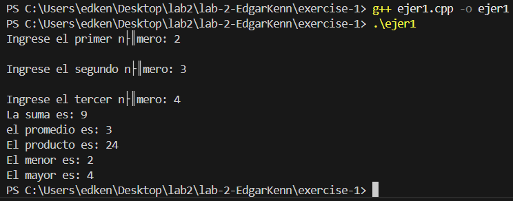

# Ejercicio de laboratorio 1: Suma, Promedio, Máximo y Mínimo

## Descripción

Escriba un programa que lea tres números enteros del teclado e imprima la suma, el promedio, el producto, el más pequeño y el más grande de estos números. El diálogo de la pantalla debería aparecer de la siguiente manera:

```cmd
Ingrese tres enteros diferentes: 13 27 14
La suma is 54
El promedio es 18
El producto es 4914
El más pequeño es 13
El más grande es 27
```

## Contesta las siguientes preguntas

1. Modifique su solución para usar tres declaraciones cin separadas en lugar de una. Escribe un mensaje separado para cada cin.

2. ¿Importa si se usa < o <= al hacer comparaciones para determinar el número entero más pequeño? ¿Cuál usaste y por qué? R= Yo usé "<" por que hay que recordar que en los arrays se empieza a contar desde el 0, por lo que si quiero contar 3 espacios, debo terminar la secuencia antes de llegar a 3

3. En el programa, probablemente usó una variable double o float para almacenar el promedio. Cambie el tipo de esa variable a entero. ¿El resultado es diferente de lo que observó anteriormente? R= Sí cambia el valor, por que al solo admitir números enteros, el promedio se redondea

## ✅ Resultado


